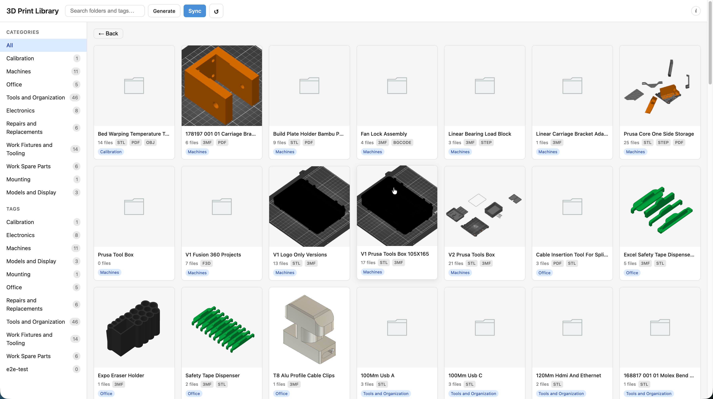
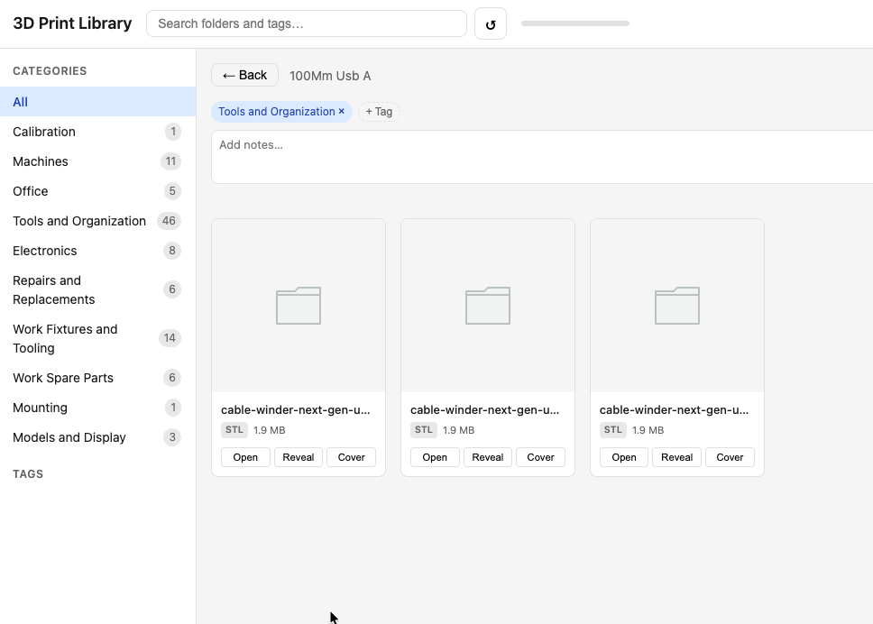
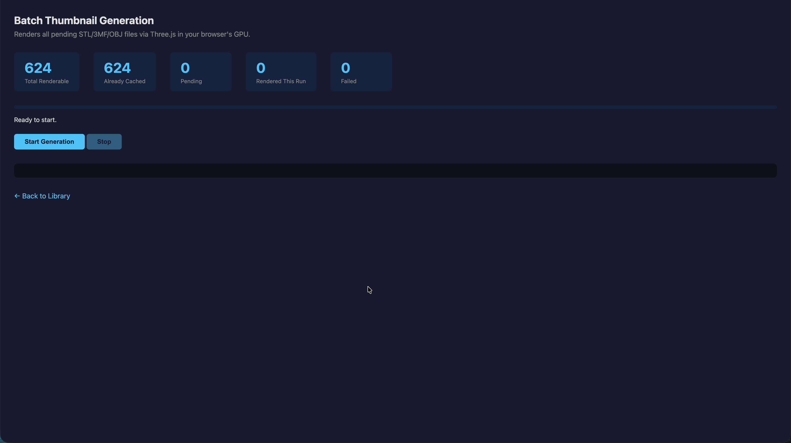

# 3D Print Library Manager

A lightweight, browser-based visual library for managing local 3D print file collections. No cloud, no Docker, no accounts — just a Python server and your browser.



## Features

- **Visual thumbnail grid** — browse your entire collection at a glance
- **Two-level navigation** — folder grid drills into individual file cards
- **Client-side 3D rendering** — STL/OBJ/3MF thumbnails rendered via Three.js in your browser's GPU
- **3MF embedded preview extraction** — instant thumbnails for 74% of 3MF files (no rendering needed)
- **Tags and search** — tag folders, filter by category, full-text search
- **One-click Open/Reveal** — open files in your slicer or reveal in Finder/Explorer
- **Batch thumbnail generation** — render all pending thumbnails in one go at `/generate`
- **Auto-sort from Downloads** — ingest new files from a watched folder, auto-categorize by keyword, deduplicate, and organize into the library
- **Web-based sync controls** — configure source/library folders, run sync or schedule it, preview before executing
- **Setup wizard** — first-run wizard picks your library location and category mode (starter, use existing, or blank)
- **Cross-platform** — identical experience on macOS and Windows
- **Single dependency** — just Flask. Three.js loads from CDN.



## Quick Start

```bash
# Clone the repo
git clone https://github.com/dorfman2/3d_print_library_manager.git
cd 3d_print_library_manager

# Install the one dependency
pip install flask

# Point the scanner at your 3D print folder, scan, and start
cd .library
python scanner.py
python server.py
```

Open **http://localhost:5050** in your browser.

## Deployment

### Requirements

- Python 3.9+
- pip
- A modern browser with WebGL (Chrome, Firefox, Safari, Edge)

### Step 1: Clone and install

```bash
git clone https://github.com/dorfman2/3d_print_library_manager.git
cd 3d_print_library_manager
pip install -r .library/requirements.txt
```

### Step 2: Configure your library path

The scanner looks for a specific folder structure. Your 3D print files should be organized in numbered category folders:

```
Your 3D Prints Folder/
├── .library/          ← this repo's code lives here
├── 0 - Calibration/
│   └── Bed Warping Tests/
│       ├── bed50.stl
│       └── bed60.stl
├── 1 - Machines/
│   └── Fan Lock Assembly/
│       ├── Fan Lock.3mf
│       └── Fan Lock.stl
├── 2 - Office/
│   └── ...
└── ...
```

Copy or symlink the `.library/` folder into the root of your 3D print collection:

```bash
# Option A: move the repo's .library into your prints folder
cp -r .library "/path/to/your/3D Prints/"

# Option B: symlink
ln -s "$(pwd)/.library" "/path/to/your/3D Prints/.library"
```

### Step 3: Run the initial scan

```bash
cd "/path/to/your/3D Prints/.library"
python scanner.py
```

This indexes all files, computes content hashes, and extracts embedded previews from 3MF files. Takes about 30-60 seconds for ~700 files.

### Step 4: Start the server

```bash
python server.py
```

The server binds to `127.0.0.1:5050` (local only, not network-accessible).

### Step 5: Generate thumbnails

Open **http://localhost:5050/generate** in your browser. Click **Start Generation** to render all STL/OBJ thumbnails via Three.js. This uses your GPU and typically takes 2-5 minutes for a few hundred files.



### Running as a background service (optional)

**macOS (launchd):**

```bash
# Create a plist at ~/Library/LaunchAgents/com.3dprint.library.plist
cat << 'EOF' > ~/Library/LaunchAgents/com.3dprint.library.plist
<?xml version="1.0" encoding="UTF-8"?>
<!DOCTYPE plist PUBLIC "-//Apple//DTD PLIST 1.0//EN" "http://www.apple.com/DTDs/PropertyList-1.0.dtd">
<plist version="1.0">
<dict>
    <key>Label</key>
    <string>com.3dprint.library</string>
    <key>ProgramArguments</key>
    <array>
        <string>/usr/bin/python3</string>
        <string>server.py</string>
    </array>
    <key>WorkingDirectory</key>
    <string>/path/to/your/3D Prints/.library</string>
    <key>RunAtLoad</key>
    <true/>
    <key>KeepAlive</key>
    <true/>
</dict>
</plist>
EOF

launchctl load ~/Library/LaunchAgents/com.3dprint.library.plist
```

**Windows (Task Scheduler):**

1. Open Task Scheduler
2. Create Basic Task → "3D Print Library"
3. Trigger: At logon
4. Action: Start a program
   - Program: `python`
   - Arguments: `server.py`
   - Start in: `C:\path\to\your\3D Prints\.library`

## Usage

### Browsing

- **Level 1** — shows all model folders as cards with cover thumbnails
- Click a folder → **Level 2** shows individual files with format badges, sizes, and action buttons
- Use the **category sidebar** to filter by top-level category
- Use the **tag sidebar** to filter by tags
- **Search bar** filters folder names and tags in real-time

### Auto-Sort (Ingest → Browse)

1. Download 3D print files to your normal Downloads folder
2. Open **http://localhost:5050/sync** → click **Preview (Dry Run)** to see where files would go
3. Click **Run Sync Now** to move files into the library, auto-categorized by keywords
4. Newly sorted files appear in the browser immediately (auto-reindex after sync)

**Scheduled sync:** Enable the scheduler on the Sync panel to auto-sort every N minutes.

**Category editor:** Add, rename, or delete categories and edit keyword lists on the Sync panel.

### File Actions

- **Open** — opens the file in your OS default app (PrusaSlicer, BambuStudio, etc.)
- **Reveal** — highlights the file in Finder (macOS) or Explorer (Windows)
- **Cover** — sets this file's thumbnail as the folder's cover image

### Tagging

- Click **+ Tag** on any folder in Level 2 to add custom tags
- Click the × on a tag to remove it
- Tags are never auto-deleted — even if you rescan

### Rescanning

Click the **↺ Scan** button in the header or run `python scanner.py` from terminal. The scan is incremental — only changed/new files are processed.

## Architecture

```
.library/
├── scanner.py       ← Filesystem walker, DB indexer, 3MF preview extractor
├── server.py        ← Flask REST API + static file server (port 5050)
├── sorter.py        ← Auto-sort: 5-phase sync pipeline (ingest from Downloads)
├── config.py        ← Shared config load/save (JSON)
├── categories.py    ← Category list, keyword scoring, name cleanup
├── library.db       ← SQLite database (auto-created)
├── thumbnails/      ← Cached PNG thumbnails
├── requirements.txt ← flask>=3.0
└── static/
    ├── index.html   ← SPA shell
    ├── app.js       ← UI + Three.js thumbnail renderer
    ├── style.css    ← Layout and theme
    ├── generate.html← Batch thumbnail generator
    └── icons/       ← SVG format icons
```

### Thumbnail Pipeline

1. **3MF files** — scanner extracts embedded preview PNGs from the ZIP at scan time (covers ~74% of 3MF files)
2. **STL/OBJ/remaining 3MF** — browser renders via Three.js on first view, POSTs the PNG back to the server for caching
3. **STEP/F3D/bgcode/PDF** — shown with static format icons (not renderable in browser)
4. **Subsequent loads** — all thumbnails served as static PNGs from cache

### Supported Formats

| Format | Thumbnail | Open/Reveal |
|--------|-----------|-------------|
| .stl | Three.js render | Yes |
| .3mf | Embedded or Three.js | Yes |
| .obj | Three.js render | Yes |
| .step/.stp | Icon | Yes |
| .f3d | Icon | Yes |
| .bgcode | Icon | Yes |
| .pdf | Icon | Yes |

## Configuration

The scanner automatically:
- Detects top-level category folders (pattern: `N - Name`)
- Flattens Printables-style `files/` and `images/` subfolders into their parent
- Creates synthetic "(Loose Files)" folder cards for orphaned files in category roots
- Skips folders with zero printable files
- Cleans display names (strips `_model_files`, UUIDs, Printables IDs)

No config file needed. To change the port, edit the last line of `server.py`.

## Adding Screenshots

After launching the app, take screenshots and save them to `docs/screenshots/`:

```bash
mkdir -p docs/screenshots
# Save these screenshots:
# - docs/screenshots/level1-folder-grid.png (main view with folder cards)
# - docs/screenshots/level2-file-grid.png (inside a folder showing files)
# - docs/screenshots/batch-generate.png (the /generate page)
```

## Optional: Windows Tray Wrapper

For a "launch at login" experience on Windows, you can create a thin tray app that:
1. Starts `server.py` on login
2. Shows a system tray icon with "Open Library" and "Sync Now" options
3. Calls `sorter.py` directly — no logic duplication

This is **not required** — the web UI provides all the same controls. The tray wrapper is purely a convenience for users who prefer a desktop-native autostart on Windows. On macOS, use the launchd plist shown in the Deployment section.

## License

MIT — see [LICENSE](LICENSE).
