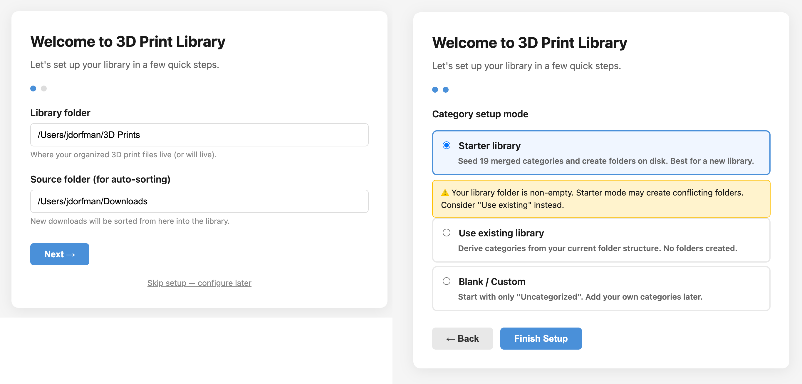
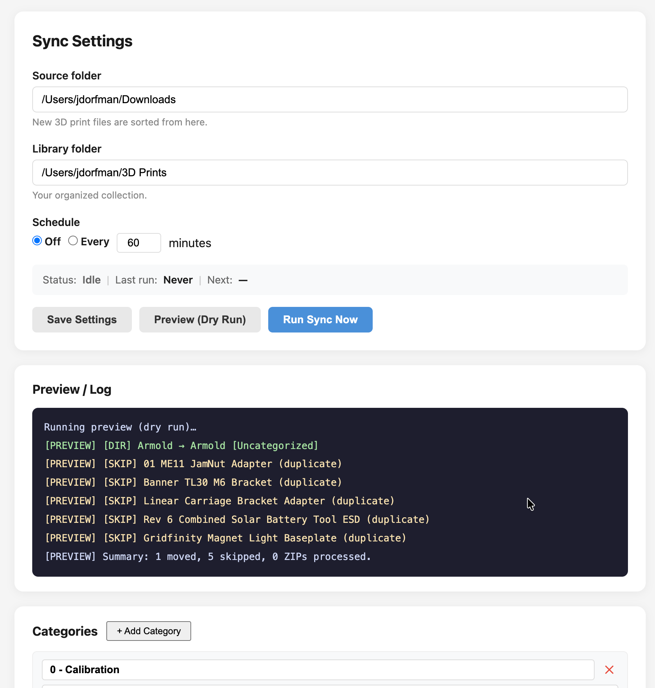
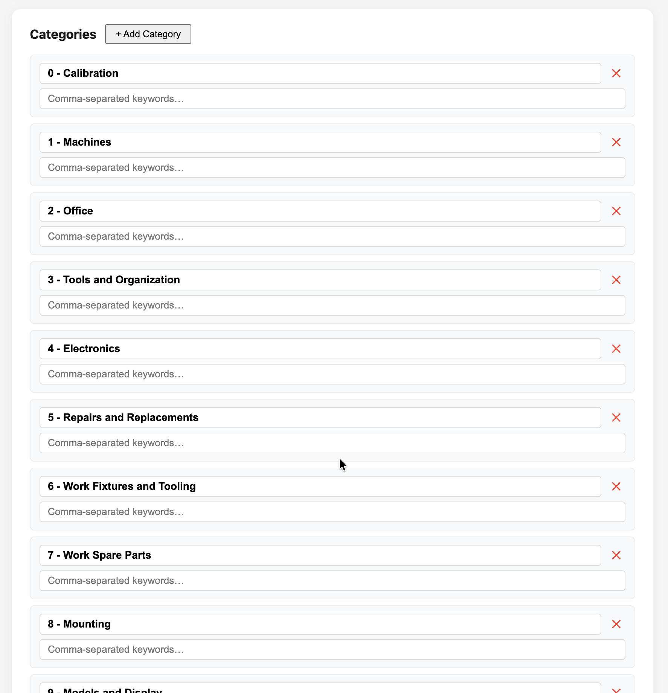

# 3D Print Library Manager

**v1.0.0-rc** · A cross-platform app that ingests, organizes, and visually browses
your local 3D print file collection. No cloud, no Docker, no accounts — just a
Python server and your browser.

It covers the whole lifecycle: **download → auto-sort → browse**.


## What it does

Two halves working together:

- **Sorter (ingest)** — watches a Source folder (your Downloads by default),
  cleans up messy file names, categorizes by keyword, handles ZIPs, deduplicates,
  and files everything into your organized library.
- **Viewer (browse)** — a visual thumbnail library with two-level navigation,
  tags, search, 3D-rendered thumbnails, and one-click open/reveal.

Both run in a single Flask process controlled entirely from the browser.

## Features

- **First-run setup wizard** — pick your library location and category mode
  (merged starter library, use your existing folders, or start blank)
- **Auto-sort from Downloads** — keyword categorization, name cleanup, ZIP
  extraction, duplicate detection; run on demand or on a schedule
- **Visual thumbnail grid** — browse the whole collection at a glance
- **Two-level navigation** — folder grid drills into individual file cards
- **Client-side 3D rendering** — STL/OBJ/3MF thumbnails via Three.js (your GPU)
- **3MF embedded preview extraction** — instant thumbnails for most 3MF files
- **Tags and search** — tag folders, filter by category, full-text search
- **One-click Open/Reveal** — open in your slicer or reveal in Finder/Explorer
- **Category editor** — add, rename, delete categories and edit keyword lists
- **Batch thumbnail generation** — render all pending thumbnails at `/generate`
- **Cross-platform** — identical on macOS and Windows
- **Tested** — 46 real-filesystem integration tests, no mocks


## Quick Start

```bash
git clone https://github.com/dorfman2/3d_print_library_manager.git
cd 3d_print_library_manager
pip install -r .library/requirements.txt

cd .library
python server.py
```

Open **http://localhost:5050** — on first run you'll land on the setup wizard.



## First-Run Setup

The wizard asks two things:

1. **Folders** — where your library lives (default `~/3D Prints`) and which
   Source folder to watch for new files (default `~/Downloads`).
2. **Category mode:**
   - **Starter library** — seeds the merged 19-category starter set and creates
     the folders. Best for a fresh library.
   - **Use existing library** — reads categories from your existing on-disk folder
     names. Nothing is created or renamed. Best if you already have an organized
     collection.
   - **Blank** — starts with only `Uncategorized`; you build categories yourself.

The wizard writes `config.json` and `categories.json`, then drops you into the
library. You can reconfigure everything later from the Sync panel.

## Auto-Sort Workflow (Ingest → Browse)

1. Download 3D print files to your Downloads folder as usual.
2. Open **http://localhost:5050/sync** and click **Preview (Dry Run)** to see
   exactly where each file would land.
3. Click **Run Sync Now** to move and categorize them.
4. Newly sorted files appear in the browser immediately — the library re-indexes
   automatically after every sync.



**Scheduled sync** — enable the scheduler to auto-sort every N minutes (1–1440).

**Category editor** — tune categories and their keywords right on the Sync panel.



## Browsing

- **Level 1** — model folders as cards with cover thumbnails
- **Level 2** — click a folder to see individual files with format badges and sizes
- **Category sidebar** — filter by top-level category
- **Tag sidebar** — filter by tag
- **Search bar** — filters folder names and tags in real time

### File actions

- **Open** — opens the file in your OS default app (PrusaSlicer, Bambu Studio, etc.)
- **Reveal** — highlights the file in Finder (macOS) or Explorer (Windows)
- **Cover** — sets that file's thumbnail as the folder's cover

### Tagging

Add tags with **+ Tag** on any folder; remove with the ×. Tags, notes, and cover
selections are never auto-deleted — they even survive a folder being moved or
re-categorized by the sorter.

## Batch Thumbnail Generation

Open **http://localhost:5050/generate** and click **Start Generation** to render
every pending STL/OBJ thumbnail via Three.js. Uses your GPU; a few hundred files
take a couple of minutes. 3MF files with embedded previews are already cached at
scan time.


## Requirements

- Python 3.9+
- A modern browser with WebGL (Chrome, Firefox, Safari, Edge)
- Only runtime dependency: Flask (Three.js loads from CDN)

## Architecture

```
.library/
├── server.py          Flask REST API + static server (port 5050)
├── scanner.py         Filesystem indexer, 3MF preview extraction, metadata migration
├── sorter.py          5-phase auto-sort pipeline (ingest from Downloads)
├── categories.py      Name cleanup + keyword categorization
├── config.py          Shared config + cross-platform path resolution
├── categories.default.json   Merged 19-category starter list
├── library.db         SQLite index (auto-created, gitignored)
├── thumbnails/        Cached PNG thumbnails (gitignored)
├── tests/             46 real-filesystem integration tests
└── static/            index.html, app.js, style.css, setup.html, sync.html, sync.js
```

### Thumbnail pipeline

1. **3MF** — scanner extracts embedded preview PNGs from the ZIP at scan time
2. **STL / OBJ / 3MF without preview** — browser renders via Three.js on first
   view, POSTs the PNG back for caching
3. **STEP / F3D / bgcode / PDF** — static format icons
4. **Subsequent loads** — served as cached static PNGs

### Supported formats

| Format | Thumbnail | Open/Reveal | Auto-sort |
|--------|-----------|-------------|-----------|
| .stl | Three.js render | Yes | Yes |
| .3mf | Embedded or Three.js | Yes | Yes |
| .obj | Three.js render | Yes | Yes |
| .step / .stp | Icon | Yes | Yes |
| .f3d / .f3z | Icon | Yes | Yes |
| .amf | Icon | Yes | Yes |
| .bgcode / .gcode / .gco | Icon | Yes | Yes |
| .pdf | Icon | Yes | — |

## Testing

Real-filesystem integration tests (no mocks):

```bash
pip install pytest
cd .library
python -m pytest tests/ -v
```

46 tests cover name cleanup, keyword categorization, all five sorter phases on
temporary directories (including ZIP path-traversal safety), config round-trips,
and folder-metadata migration.

## Running as a Background Service (optional)

**macOS (launchd)** — create `~/Library/LaunchAgents/com.3dprint.library.plist`:

```xml
<?xml version="1.0" encoding="UTF-8"?>
<!DOCTYPE plist PUBLIC "-//Apple//DTD PLIST 1.0//EN" "http://www.apple.com/DTDs/PropertyList-1.0.dtd">
<plist version="1.0">
<dict>
    <key>Label</key><string>com.3dprint.library</string>
    <key>ProgramArguments</key>
    <array>
        <string>/usr/bin/python3</string>
        <string>server.py</string>
    </array>
    <key>WorkingDirectory</key><string>/path/to/your/3D Prints/.library</string>
    <key>RunAtLoad</key><true/>
    <key>KeepAlive</key><true/>
</dict>
</plist>
```

```bash
launchctl load ~/Library/LaunchAgents/com.3dprint.library.plist
```

**Windows (Task Scheduler)** — Create Basic Task → trigger "At logon" → action
"Start a program": program `python`, arguments `server.py`, start-in
`C:\path\to\your\3D Prints\.library`.

The web UI provides all sync controls, so a desktop tray app is not required.

## Security

The server binds to `127.0.0.1:5050` only — it is not exposed to your network.
There is no authentication because it is a single-user local tool. Do not put it
behind a public reverse proxy without adding your own auth layer.

## License

MIT — see [LICENSE](LICENSE).
